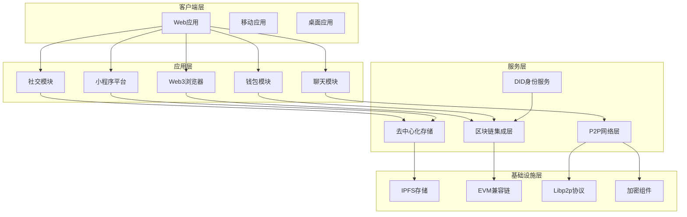
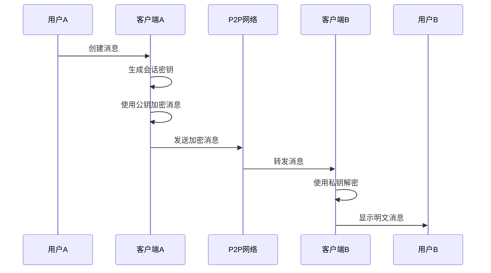
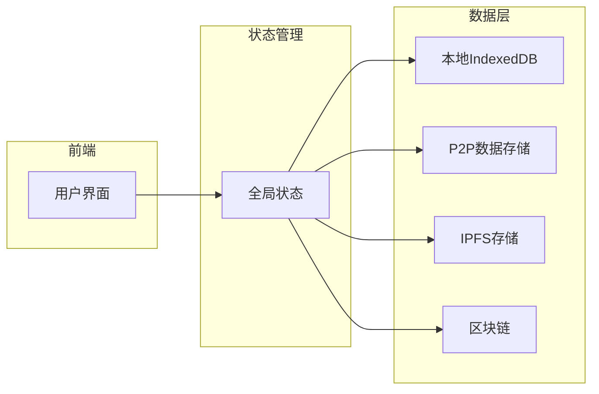

# 去中心化聊天平台

Feature Name: decentralized-chat-platform
Updated: 2026-02-13

## 描述

这是一个综合性的去中心化应用平台,集成了匿名双向加密聊天、Web3浏览器、社交功能(朋友圈和微社区)、加密货币管理(转账和红包)以及小程序平台。该系统采用去中心化架构,利用区块链技术确保数据隐私、安全性和抗审查性,同时提供丰富的社交和金融功能。

## 架构

### 系统架构概览



### 聊天系统架构



### 数据流架构



## 组件和接口

### 核心组件

#### 1. ChatModule (聊天模块)

**职责**: 处理端到端加密消息传输、会话管理和消息存储

**接口**:
```typescript
interface IChatModule {
  sendMessage(peerId: string, content: string, options: MessageOptions): Promise<Message>
  createConversation(peerIds: string[], encryption: EncryptionType): Promise<Conversation>
  getConversationMessages(conversationId: string): Promise<Message[]>
  deleteMessage(messageId: string): Promise<void>
  markAsRead(conversationId: string, messageId: string): Promise<void>
}

interface Message {
  id: string
  conversationId: string
  senderId: string
  content: string
  encrypted: boolean
  timestamp: number
  status: MessageStatus
}

enum MessageStatus {
  SENT = 'sent',
  DELIVERED = 'delivered',
  READ = 'read',
  FAILED = 'failed'
}
```

#### 2. SocialModule (社交模块)

**职责**: 管理朋友圈、微社区、关注关系和社交互动

**接口**:
```typescript
interface ISocialModule {
  // 朋友圈
  postMoment(content: string, media: Media[], visibility: Visibility): Promise<Moment>
  getMomentsFeed(userId?: string, limit: number): Promise<Moment[]>
  likeMoment(momentId: string): Promise<void>
  commentOnMoment(momentId: string, content: string): Promise<Comment>

  // 微社区
  createCommunity(name: string, description: string, rules: CommunityRules): Promise<Community>
  joinCommunity(communityId: string): Promise<void>
  createPost(communityId: string, content: string): Promise<Post>
  getCommunityPosts(communityId: string): Promise<Post[]>
}

interface Moment {
  id: string
  authorId: string
  content: string
  media: Media[]
  visibility: Visibility
  likes: number
  comments: Comment[]
  timestamp: number
}

interface Community {
  id: string
  name: string
  description: string
  ownerId: string
  members: string[]
  rules: CommunityRules
  createdAt: number
}
```

#### 3. Web3Browser (Web3浏览器)

**职责**: 提供去中心化应用(DApp)访问和智能合约交互功能

**接口**:
```typescript
interface IWeb3Browser {
  connectWallet(): Promise<WalletAccount>
  signTransaction(tx: Transaction): Promise<SignedTransaction>
  sendTransaction(tx: SignedTransaction): Promise<TransactionReceipt>
  callContract(address: string, abi: Abi, method: string, params: any[]): Promise<any>
  watchContractEvent(address: string, event: string, callback: (data: any) => void): UnsubscribeFunction
}

interface WalletAccount {
  address: string
  chainId: number
  balance: string
}
```

#### 4. WalletModule (钱包模块)

**职责**: 管理加密货币、代币、转账和红包功能

**接口**:
```typescript
interface IWalletModule {
  // 账户管理
  createAccount(): Promise<Account>
  importAccount(privateKey: string): Promise<Account>
  getBalance(tokenAddress?: string): Promise<Balance>
  getTransactionHistory(): Promise<Transaction[]>

  // 转账
  transfer(to: string, amount: string, tokenAddress?: string): Promise<TransactionHash>
  estimateGas(to: string, amount: string): Promise<GasEstimate>

  // 红包
  createRedPacket(totalAmount: string, count: number, type: RedPacketType): Promise<RedPacket>
  grabRedPacket(redPacketId: string): Promise<RedPacketResult>

  // 自定义代币
  createToken(config: TokenConfig): Promise<TokenAddress>
  getTokenInfo(tokenAddress: string): Promise<TokenInfo>
}

interface RedPacket {
  id: string
  senderId: string
  totalAmount: string
  remainingAmount: string
  count: number
  claimed: number
  type: RedPacketType
  password?: string
  createdAt: number
  expiresAt: number
}
```

#### 5. MiniAppPlatform (小程序平台)

**职责**: 提供小程序运行环境、应用市场和生命周期管理

**接口**:
```typescript
interface IMiniAppPlatform {
  // 应用市场
  installApp(appId: string): Promise<void>
  uninstallApp(appId: string): Promise<void>
  getInstalledApps(): Promise<MiniApp[]>
  searchApps(query: string): Promise<MiniApp[]>

  // 运行时
  launchApp(appId: string, params?: any): Promise<void>
  sendMessageToApp(appId: string, message: any): Promise<any>
  getAppPermissions(appId: string): Promise<Permission[]>
}

interface MiniApp {
  id: string
  name: string
  version: string
  description: string
  icon: string
  permissions: Permission[]
  size: number
  developer: string
}
```

### 基础设施组件

#### 6. P2PNetwork (P2P网络层)

**职责**: 基于libp2p实现去中心化数据传输和节点发现

**接口**:
```typescript
interface IP2PNetwork {
  start(): Promise<void>
  stop(): Promise<void>
  connectToPeer(peerId: string): Promise<Connection>
  broadcast(topic: string, data: any): Promise<void>
  subscribe(topic: string, handler: (data: any) => void): Subscription
  getConnectedPeers(): Promise<PeerInfo[]>
}

interface PeerInfo {
  id: string
  addresses: string[]
  latency?: number
}
```

#### 7. Encryption (加密组件)

**职责**: 提供端到端加密、数字签名和密钥管理

**接口**:
```typescript
interface IEncryptionService {
  // 密钥生成
  generateKeyPair(): Promise<KeyPair>
  deriveSharedKey(privateKey: string, publicKey: string): Promise<string>
  generateSymmetricKey(): Promise<string>

  // 加密解密
  encrypt(data: string, key: string): Promise<EncryptedData>
  decrypt(encryptedData: EncryptedData, key: string): Promise<string>
  encryptWithPublicKey(data: string, publicKey: string): Promise<string>
  decryptWithPrivateKey(encryptedData: string, privateKey: string): Promise<string>

  // 数字签名
  sign(data: string, privateKey: string): Promise<string>
  verify(data: string, signature: string, publicKey: string): Promise<boolean>

  // 密钥存储
  storePrivateKey(key: string, password: string): Promise<void>
  getPrivateKey(password: string): Promise<string>
}
```

## 数据模型

### 用户身份

```typescript
interface User {
  did: string                    // 去中心化身份标识
  publicKey: string              // 公钥
  profile: {
    name?: string                // 显示名称(可选)
    avatar?: string              // 头像IPFS哈希
    bio?: string                 // 个人简介
  }
  createdAt: number
  lastActive: number
}
```

### 会话

```typescript
interface Conversation {
  id: string
  type: 'direct' | 'group'
  participants: string[]         // 参与者DID列表
  encryptionKey: string          // 加密的会话密钥
  lastMessageId?: string
  unreadCount: number
  createdAt: number
}
```

### 消息

```typescript
interface Message {
  id: string
  conversationId: string
  senderId: string
  content: string               // 加密的消息内容
  type: 'text' | 'image' | 'video' | 'file'
  attachments?: Attachment[]
  timestamp: number
  status: MessageStatus
}
```

### 加密货币账户

```typescript
interface CryptoAccount {
  address: string                // 钱包地址
  privateKeyEncrypted: string   // 加密的私钥
  chainId: number               // 链ID
  tokens: TokenBalance[]        // 代币余额
  nonce: number                 // 交易计数器
}
```

### 自定义代币

```typescript
interface Token {
  address: string
  name: string
  symbol: string
  decimals: number
  totalSupply: string
  owner: string
  createdAt: number
  contractAbi: string          // 智能合约ABI
}
```

### 小程序

```typescript
interface MiniApp {
  appId: string
  name: string
  version: string
  description: string
  codeHash: string              // IPFS上的代码哈希
  manifest: MiniAppManifest      // 应用清单
  permissions: Permission[]     // 所需权限
  reviews: Review[]             // 用户评价
  downloadCount: number
  rating: number
}
```

## 正确性属性

### 不变性约束

1. **消息完整性**: 所有消息必须在传输过程中保持内容不变
   - 校验: 消息哈希与解密后内容哈希匹配

2. **加密一致性**: 只有通信双方持有的私钥才能解密消息
   - 校验: 非预期接收方无法解密消息

3. **余额一致性**: 转账前后,所有账户余额总和保持不变(扣除手续费)
   - 校验: `beforeTotal = afterTotal + gasFee`

4. **红包总额**: 红包已领取金额 + 剩余金额 = 总金额
   - 校验: `totalAmount = claimedAmount + remainingAmount`

5. **代币供应量**: 所有持有人余额之和 = 代币总供应量
   - 校验: `sum(holderBalances) = totalSupply`

### 安全属性

1. **私密性**: 未授权方无法访问用户数据
   - 实现: 使用端到端加密和去中心化存储

2. **不可伪造性**: 消息和交易无法被他人伪造
   - 实现: 使用数字签名验证身份

3. **不可抵赖性**: 发送方无法否认已发送的消息或交易
   - 实现: 所有操作都有数字签名和区块链记录

4. **可用性**: 系统在部分节点故障时仍能提供服务
   - 实现: P2P网络冗余和IPFS内容寻址

## 错误处理

### 错误分类

1. **网络错误**
   - P2P连接失败: 自动重连,最多3次
   - 消息发送超时: 标记为失败,允许重试
   - IPFS数据不可用: 使用本地缓存,后台重试

2. **加密错误**
   - 密钥解密失败: 提示用户检查密码,限制重试次数
   - 签名验证失败: 拒绝操作,记录安全事件
   - 密钥生成失败: 重新生成,记录错误日志

3. **交易错误**
   - 余额不足: 阻止交易,提示用户充值
   - Gas费用估算失败: 使用默认值,显示警告
   - 交易确认超时: 标记为待确认,允许查询状态
   - 智能合约执行失败: 返回错误消息,记录交易哈希

4. **应用错误**
   - 小程序启动失败: 显示错误,提供重新安装选项
   - 权限拒绝: 解释权限用途,允许重新授权
   - 数据格式错误: 验证输入,返回具体错误信息

### 错误处理策略

```typescript
interface ErrorHandling {
  // 网络错误
  handleNetworkError(error: NetworkError): void {
    if (error.retryable && retryCount < 3) {
      setTimeout(() => retry(), 1000 * Math.pow(2, retryCount))
    } else {
      showError('网络连接失败,请检查网络设置')
    }
  }

  // 加密错误
  handleCryptoError(error: CryptoError): void {
    if (error.type === 'INVALID_PASSWORD') {
      showError('密码错误,请重试')
      incrementFailedAttempts()
      if (failedAttempts >= 3) {
        lockAccount(5 * 60 * 1000) // 锁定5分钟
      }
    } else {
      logError(error)
      showError('加密操作失败')
    }
  }

  // 交易错误
  handleTransactionError(error: TransactionError): void {
    switch (error.reason) {
      case 'INSUFFICIENT_FUNDS':
        showError('余额不足')
        break
      case 'CONTRACT_EXECUTION_FAILED':
        showError('合约执行失败: ' + error.message)
        break
      default:
        showError('交易失败: ' + error.message)
    }
    saveTransactionForRetry(error.tx)
  }
}
```

## 测试策略

### 单元测试

- 覆盖所有加密函数的正确性和边界情况
- 测试数据模型的序列化和反序列化
- 验证业务逻辑的正确性(如红包分配算法)
- 目标代码覆盖率: >80%

### 集成测试

- 测试P2P网络通信的可靠性
- 验证智能合约与钱包模块的集成
- 测试模块间的数据流和状态同步
- 使用测试网络(Ropsten/Sepolia)进行区块链测试

### 端到端测试

- 模拟完整的用户旅程: 注册→聊天→转账→发红包
- 测试多用户并发场景
- 验证跨平台功能一致性
- 使用Playwright进行自动化UI测试

### 安全测试

- 渗透测试: SQL注入、XSS、CSRF等漏洞扫描
- 密码学审计: 确保加密实现符合标准
- 智能合约审计: 检查合约漏洞(重入攻击、溢出等)
- 使用工具: MythX, Slither, Hardhat

### 性能测试

- 负载测试: 模拟1000+并发用户
- 压力测试: 测试系统极限容量
- 响应时间测试: 确保关键操作在SLA时间内完成
- 使用工具: k6, JMeter

### 测试环境

- 本地开发环境: 使用模拟区块链(Ganache)
- 测试网络: Sepolia测试网
- 预发布环境: 接近生产配置
- CI/CD集成: 自动化测试在每次提交时运行

## 参考

[^1]: (Website) - EIP-1559 Ethereum Improvement Proposal (https://eips.ethereum.org/EIPS/eip-1559)
[^2]: (Website) - libp2p Documentation (https://docs.libp2p.io/)
[^3]: (Website) - IPFS Documentation (https://docs.ipfs.tech/)
[^4]: (Website) - Web3.js Documentation (https://web3js.readthedocs.io/)
[^5]: (Website) - DID Core Specification (https://www.w3.org/TR/did-core/)
[^6]: (Website) - E2EE Best Practices (https://datatracker.ietf.org/doc/html/draft-ietf-privacypass-authenticated-message-with-encryption-00)
